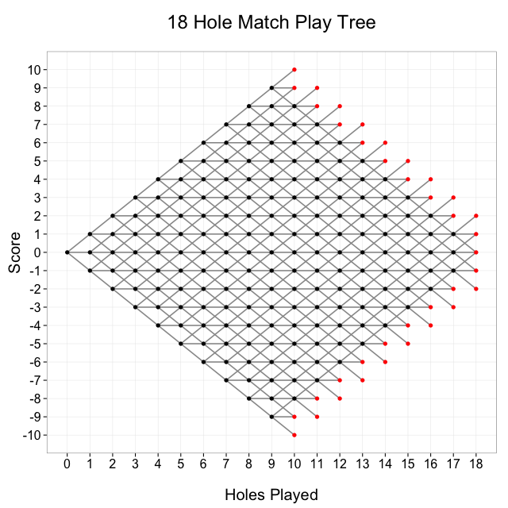

# How many paths are possible in an 18 hole round of match play golf?
### AKA Crazy Maths Super Fun Time

####[Source Article](http://toddwschneider.com/posts/how-many-paths-are-possible-in-an-18-hole-round-of-match-play-golf/)

- A match consists of one side (individual or team) playing against another over a round of 18 holes
- A hole is won by the side that holes its ball in the fewer strokes
- A hole is halved if each side holes out in the same number of strokes
- A match is won when one side leads by a number of holes greater than the number remaining to be played
- If the match is tied after 18 holes, it ends as a tie

#### Graph of all possible paths:

*Answer: 169,688,089*