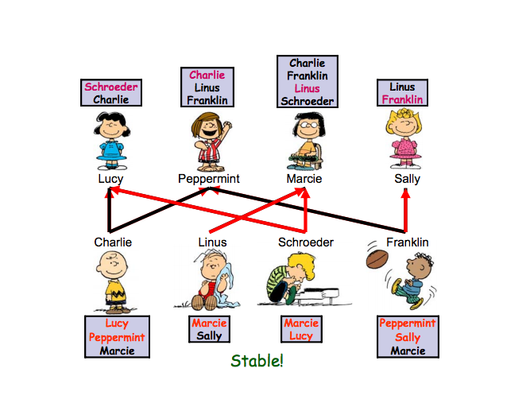

# Stable Marriage Problem

- Consider a set of n women and n men.
- Each person has an ordered list of some members of the opposite sex as his or her preference list.
- Let µ be a matching between women and men. 
- A pair (m, w) is a blocking pair if both m and w prefer being together to their assignments under µ. Also, (x, x) is a blocking pair, if x prefers being single to his/her assignment under µ.
- „ A matching is stable if it does not have any blocking pair.

