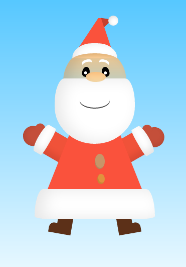

## CSSanta

Your mission is simple: as a team, decide on a design for an image of Santa, and then create it using just HTML and CSS(SCSS).

In case anyone isn't sure what he looks like, here are some reference images of Santa:

And for design inspiration, these were all built with CSS:

